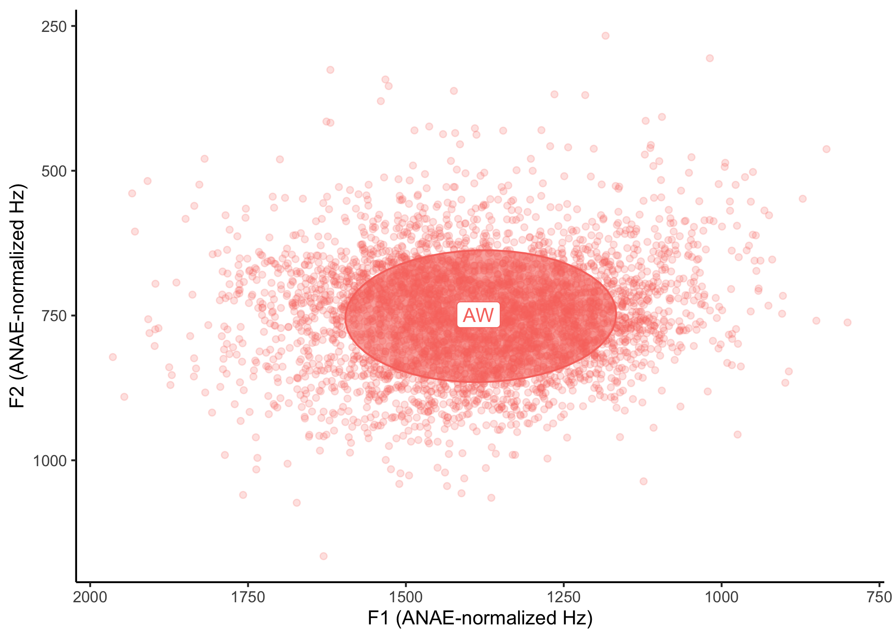
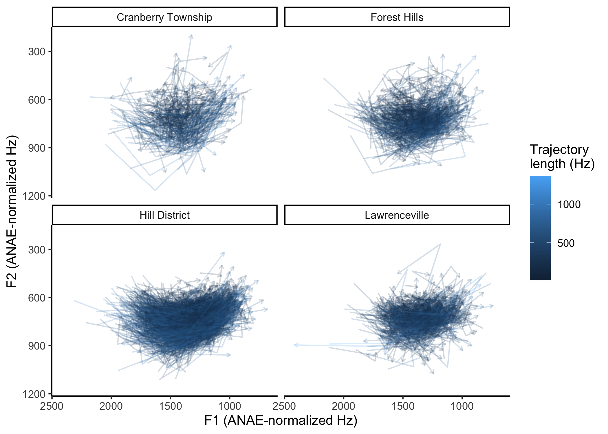
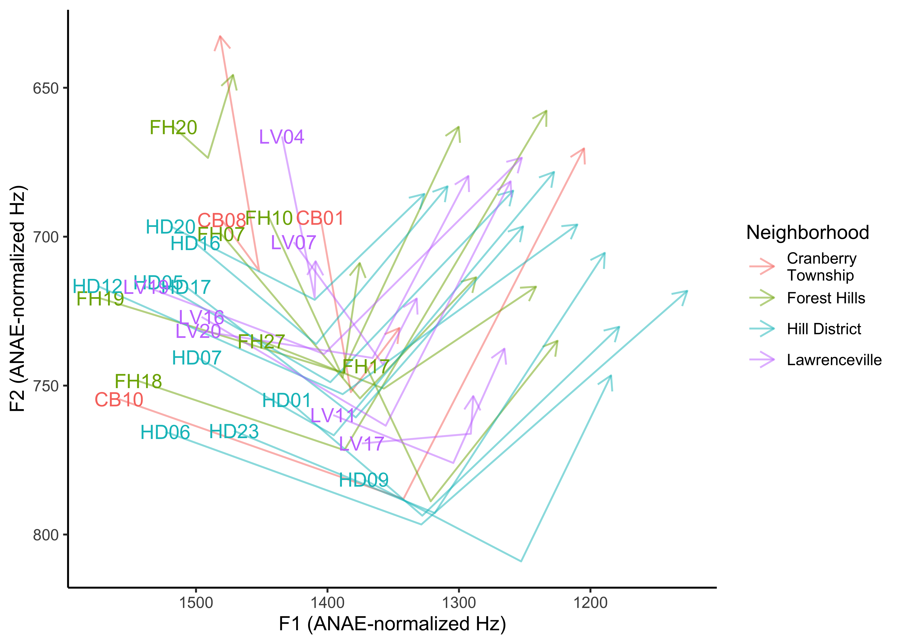

Intro to APLS Case Study
================
Jack Rechsteiner
2025-06-15

- [Simple vowel case study](#simple-vowel-case-study)
- [Don’t use: Speaker trajectories](#dont-use-speaker-trajectories)
- [Session Info](#session-info)

## Simple vowel case study

``` r
#reading in vowel data
vowel_data <- read.csv("csvs/results_processwithpraat.csv") |>
  mutate(Neighborhood = case_when(startsWith(Speaker, "CB") ~ "Cranberry Township",
                                  startsWith(Speaker, "FH") ~ "Forest Hills",
                                  startsWith(Speaker, "HD") ~ "Hill District",
                                  startsWith(Speaker, "LV") ~ "Lawrenceville",
                                  TRUE ~ "Interviewer"))

vowel_data_smaller <- vowel_data %>%
  #dropping unnecessary columns
  select(Speaker, Neighborhood, Text, Target.phonemes, starts_with("F"), MatchId)

vowel_data_outliers_removed <-
  vowel_data_smaller %>%
  group_by(Speaker) %>%
  #finding outliers based on all F1 and F2 measurements
  ##Drop speakers w/ fewer than 75 tokens for reliable outlier-checking
  filter(n() >= 75,
         !find_outliers(F1.time_0.2, F2.time_0.2, F1.time_0.5, F2.time_0.5, F1.time_0.8, F2.time_0.8)) %>%
  ungroup()

#ANAE normalization
vowel_data_normed <-
  vowel_data_outliers_removed %>% 
  group_by(Speaker) %>% 
  joeyr::norm_anae(hz_cols = c(F1.time_0.2, F2.time_0.2, F1.time_0.5, F2.time_0.5, F1.time_0.8, F2.time_0.8), token_id = row.names(.), speaker_id = Speaker) %>%
  ungroup() 

#subsetting to remove incomplete words
#I'm unsure of how /r/ or morphology affects this, so words like "how's" and "cow's" have not been removed
#i'm also assuming vowel stress doesn't matter because it wasn't included in the APLS search
vowel_data_subset <- 
  vowel_data_normed %>% 
  filter(!str_detect(Text, "~$")) %>% 
  #adding in a "vowel" column to help with plotting
  mutate(vowel = "AW",
         traj_length = eucl_dist(F2.time_0.2_anae, F1.time_0.2_anae, F2.time_0.5_anae, F1.time_0.5_anae) +
           eucl_dist(F2.time_0.5_anae, F1.time_0.5_anae, F2.time_0.8_anae, F1.time_0.8_anae))

##Longer for geom_paths
vowel_data_longer <-
  vowel_data_subset |>
  pivot_longer(ends_with("_anae"), names_to=c(".value","timestamp"), names_pattern="(F[12]).time_(0\\.\\d)_anae") |>
  ##Remove unnormalized meas
  select(-contains("time_"))
```

``` r
#plotting the vowel data
ggplot(vowel_data_subset, aes(x = F2.time_0.5_anae, y = F1.time_0.5_anae, color = vowel, label = vowel)) +
  #making slightly transparent points for each individual vowel
  geom_point(alpha = 0.2) +
  #making an ellipse for the vowel measurements overall
  stat_ellipse(level = .67, geom = "polygon", alpha = 0.6, aes(fill = vowel)) +
  #using the means data to add a label to the center
  geom_label(data = vowel_data_subset %>% 
               summarise(across(ends_with("0.5_anae"), mean),
                         across(vowel, unique))) +
  #flipping the scales, like a good vowel plot should
  scale_x_reverse("F1 (ANAE-normalized Hz)") + 
  scale_y_reverse("F2 (ANAE-normalized Hz)") +
  theme_classic() + 
  theme(legend.position="none")
```

<!-- -->

``` r
vowel_data_longer |>
  filter(Neighborhood != "Interviewer") |>
  arrange(desc(traj_length)) |>
  ggplot(aes(x = F2, y = F1, color=traj_length)) +
  #making slightly transparent points for each individual vowel
  geom_path(aes(group=MatchId), alpha=0.2, arrow=arrow(length=unit(0.05, "inches"))) +
  facet_wrap(~ Neighborhood) +
  #flipping the scales, like a good vowel plot should
  scale_x_reverse("F1 (ANAE-normalized Hz)") + 
  scale_y_reverse("F2 (ANAE-normalized Hz)") +
  labs(color="Trajectory\nlength (Hz)") +
  theme_classic()
```

<!-- -->

## Don’t use: Speaker trajectories

``` r
vowel_data_means <- 
  vowel_data_longer |>
  summarise(across(Neighborhood, unique),
            across(c(F1, F2, traj_length), mean),
            .by=c(Speaker, timestamp)) |>
  ##Break Cranberry Township across two lines
  mutate(across(Neighborhood, \(x) if_else(x=="Cranberry Township", "Cranberry\nTownship", x)))
vowel_data_means |>
  filter(Neighborhood != "Interviewer") |>
  ggplot(aes(x = F2, y = F1, color=Neighborhood)) +
  geom_path(aes(group=Speaker), alpha=0.5, arrow=arrow(length=unit(0.125, "inches"))) +
  geom_text(data=vowel_data_means |> 
              filter(Neighborhood != "Interviewer",
                     timestamp==0.2),
            aes(label = Speaker), show.legend=FALSE) +
  #flipping the scales, like a good vowel plot should
  scale_x_reverse("F1 (ANAE-normalized Hz)") + 
  scale_y_reverse("F2 (ANAE-normalized Hz)") +
  theme_classic()
```

<!-- -->

But this plot is misleading. It suggests that FH20 has
shorter-trajectory tokens and HD09 longer, but in reality, HD09’s mean
trajectory length is the shortest, FH20’s the longest:

``` r
vowel_data_means |>
  distinct(Speaker, Neighborhood, traj_length) |>
  arrange(traj_length)
```

    # A tibble: 29 × 3
       Speaker        Neighborhood          traj_length
       <chr>          <chr>                       <dbl>
     1 HD09           "Hill District"             1369.
     2 FH17           "Forest Hills"              1554.
     3 HD01           "Hill District"             1572.
     4 LV17           "Lawrenceville"             1587.
     5 LV11           "Lawrenceville"             1592.
     6 HD23           "Hill District"             1608.
     7 HD06           "Hill District"             1616.
     8 Interviewer HD "Interviewer"               1631.
     9 FH27           "Forest Hills"              1743.
    10 CB10           "Cranberry\nTownship"       1765.
    # ℹ 19 more rows

That’s because these are just averages over their onset, midpoint, and
offset measurements.

``` r
vowel_data_longer |>
  # filter(Speaker %in% c("FH20","HD09","LV04","LV17")) |>
  filter(Speaker %in% c("FH20","HD09")) |>
  ggplot(aes(x = F2, y = F1, color=traj_length)) +
  #making slightly transparent points for each individual vowel
  geom_path(aes(group=MatchId), alpha=0.5, arrow=arrow(length=unit(0.05, "inches"))) +
  facet_wrap(~ Speaker) +
  #flipping the scales, like a good vowel plot should
  scale_x_reverse("F1 (ANAE-normalized Hz)") + 
  scale_y_reverse("F2 (ANAE-normalized Hz)") +
  labs(color="Trajectory\nlength (Hz)") +
  theme_classic()
```

# Session Info

``` r
sessionInfo()
```

    R version 4.3.2 (2023-10-31)
    Platform: x86_64-apple-darwin20 (64-bit)
    Running under: macOS 15.3.1

    Matrix products: default
    BLAS:   /Library/Frameworks/R.framework/Versions/4.3-x86_64/Resources/lib/libRblas.0.dylib 
    LAPACK: /Library/Frameworks/R.framework/Versions/4.3-x86_64/Resources/lib/libRlapack.dylib;  LAPACK version 3.11.0

    locale:
    [1] en_US.UTF-8/en_US.UTF-8/en_US.UTF-8/C/en_US.UTF-8/en_US.UTF-8

    time zone: America/Detroit
    tzcode source: internal

    attached base packages:
    [1] stats     graphics  grDevices utils     datasets  methods   base     

    other attached packages:
     [1] joeyr_0.9       tidynorm_0.3.0  lubridate_1.9.4 forcats_1.0.0  
     [5] stringr_1.5.1   dplyr_1.1.4     purrr_1.1.0     readr_2.1.5    
     [9] tidyr_1.3.1     tibble_3.3.0    ggplot2_3.5.2   tidyverse_2.0.0

    loaded via a namespace (and not attached):
     [1] gtable_0.3.6       compiler_4.3.2     Rcpp_1.1.0         tidyselect_1.2.1  
     [5] scales_1.4.0       yaml_2.3.10        fastmap_1.2.0      R6_2.6.1          
     [9] labeling_0.4.3     generics_0.1.4     knitr_1.50         MASS_7.3-60.0.1   
    [13] pillar_1.11.0      RColorBrewer_1.1-3 tzdb_0.5.0         rlang_1.1.6       
    [17] utf8_1.2.6         stringi_1.8.7      xfun_0.52          timechange_0.3.0  
    [21] cli_3.6.5          withr_3.0.2        magrittr_2.0.3     digest_0.6.37     
    [25] grid_4.3.2         rstudioapi_0.17.1  hms_1.1.3          lifecycle_1.0.4   
    [29] vctrs_0.6.5        evaluate_1.0.4     glue_1.8.0         farver_2.1.2      
    [33] rmarkdown_2.29     tools_4.3.2        pkgconfig_2.0.3    htmltools_0.5.8.1 
